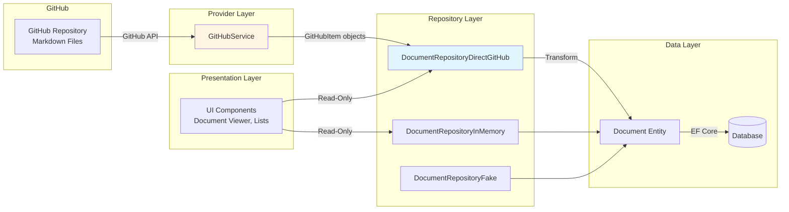
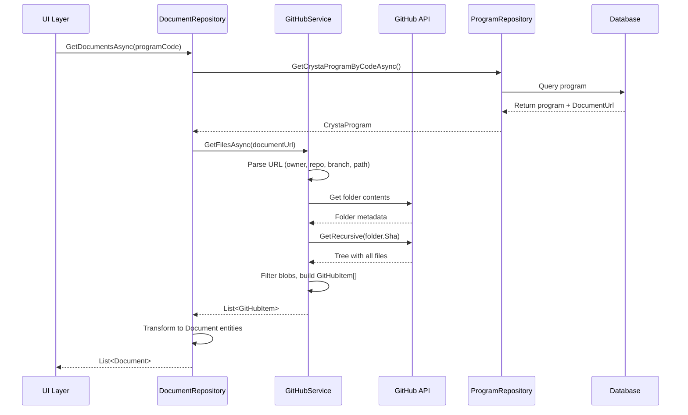
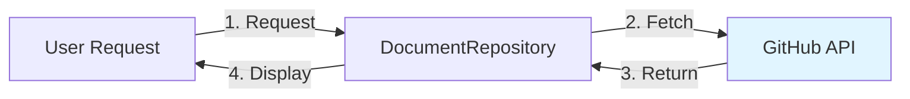
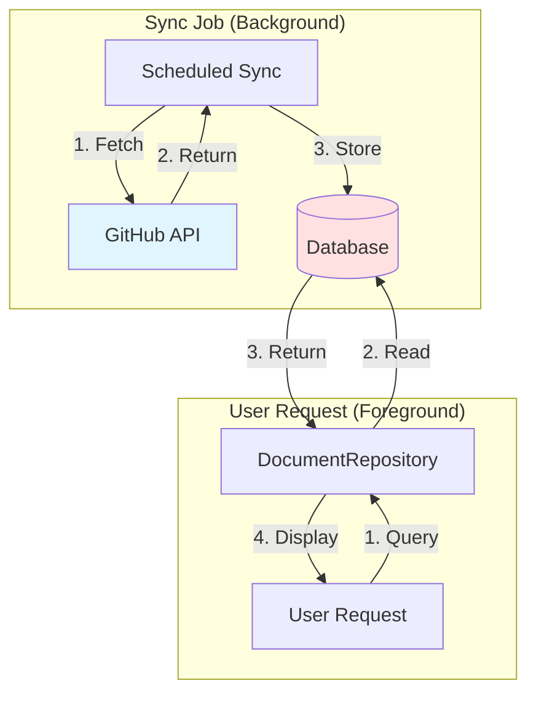
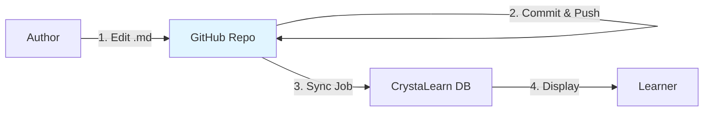

# Document Sync Overview - GitHub Integration

## Introduction

The Document Sync system synchronizes markdown documentation files from GitHub repositories into CrystaLearn as `Document` entities. This enables learners to access educational materials, specifications, and guides directly within the CrystaLearn platform while maintaining GitHub as the authoritative source for content management.

## Architecture Overview



## Key Components

### 1. Document Model

The `Document` entity represents educational content in CrystaLearn:

```csharp
public class Document : Entity
{
    // Document Identity
    [MaxLength(150)]
    public virtual string Code { get; set; }              // Unique identifier
    
    [MaxLength(200)]
    public virtual string Title { get; set; }             // Display title
    
    [MaxLength(10)]
    public virtual string Culture { get; set; }           // Language code (en, fa, etc.)
    
    // Content
    public virtual string? Content { get; set; }          // Markdown content
    
    // File Information
    [MaxLength(300)]
    public virtual string? Folder { get; set; }           // Relative folder path
    
    [MaxLength(300)]
    public virtual string? FileName { get; set; }         // File name with extension
    
    [MaxLength(50)]
    public string? FileExtension { get; set; }            // .md, .html, etc.
    
    [MaxLength(300)]
    public string? FileNameWithoutExtension { get; set; }
    
    public DocumentType DocumentType { get; set; }        // Markdown, Html, Pdf, PowerPoint
    
    // URLs
    [MaxLength(300)]
    public virtual string? SourceHtmlUrl { get; set; }    // GitHub web URL (human-readable)
    
    [MaxLength(300)]
    public virtual string? SourceContentUrl { get; set; } // GitHub API URL (raw content)
    
    [MaxLength(300)]
    public virtual string? CrystaUrl { get; set; }        // Internal CrystaLearn URL
    
    // Sync & Status
    [MaxLength(100)]
    public virtual string? LastHash { get; set; }         // SHA hash for change detection
    
    public virtual SyncInfo SyncInfo { get; set; }        // Sync metadata
    
    public virtual bool IsActive { get; set; }            // Soft delete flag
    
    // Program Association
    public virtual Guid? CrystaProgramId { get; set; }
    public virtual CrystaProgram? CrystaProgram { get; set; }
}
```

### 2. GitHubService (Provider Layer)

**Location:** `CrystaLearn.Core/Services/GitHub/GitHubService.cs`

**Responsibility:** Low-level communication with GitHub API using Octokit library

**Key Methods:**

```csharp
public partial class GitHubService : IGitHubService
{
    [AutoInject] private GitHubClient GitHubClient { get; set; }

    // Get all files recursively from a GitHub folder
    Task<List<GitHubItem>> GetFilesAsync(string url);

    // Get content of a specific file
    Task<string?> GetFileContentAsync(string url);
}
```

**URL Parsing:**

The service uses `GitHubUtil.GetFolderUrlInfo()` to parse GitHub URLs:

**Example URL:**
```
https://github.com/cs-internship/cs-internship-spec/tree/master/processes/documents
```

**Parsed Info:**
- Owner: `cs-internship`
- Repo: `cs-internship-spec`
- Branch: `master`
- Path: `processes/documents`

### 3. GitHubItem Structure

**Location:** `CrystaLearn.Core/Services/GitHub/GitHubItem.cs`

Represents a file from GitHub before transformation to `Document`:

```csharp
public class GitHubItem
{
    public string Sha { get; set; }                      // Git SHA hash
    public string FileName { get; set; }                 // File name with extension
    public string FileExtension { get; set; }            // .md, .html
    public string FileNameWithoutExtension { get; set; }
    public string RelativeFolderPath { get; set; }       // Folder within repo
    public string RelativeFilePath { get; set; }         // Full file path
    public string GitHubUrl { get; set; }                // API URL
    public string HtmlUrl { get; set; }                  // Web URL
}
```

### 4. Document Repository Implementations

The system provides multiple repository implementations for different scenarios:

#### A. DocumentRepositoryDirectGitHub (Primary)

**Location:** `CrystaLearn.Core/Services/DocumentRepositoryDirectGitHub.cs`

**Purpose:** Direct, real-time access to GitHub without local database storage

```csharp
public partial class DocumentRepositoryDirectGitHub : IDocumentRepository
{
    [AutoInject] private IGitHubService GitHubService { get; set; }
    [AutoInject] private ICrystaProgramRepository CrystaProgramRepository { get; set; }

    public async Task<List<Document>> GetDocumentsAsync(
        string programCode, 
        CancellationToken cancellationToken)
    {
        // 1. Get program configuration
        var program = await CrystaProgramRepository.GetCrystaProgramByCodeAsync(
            programCode, 
            cancellationToken);
        
        string documentUrl = program.DocumentUrl;

        // 2. Fetch files from GitHub
        var list = await GitHubService.GetFilesAsync(documentUrl);

        // 3. Transform to Document entities
        var result = new List<Document>();
        foreach(var item in list)
        {
            var doc = item.CreateDocument(program);
            result.Add(doc);
        }

        return result;
    }
}
```

**Characteristics:**
- ✅ Always up-to-date (no sync delay)
- ✅ No database storage needed
- ❌ Requires GitHub API call on each request
- ❌ Subject to GitHub API rate limits
- **Use Case:** Real-time document browsing

#### B. DocumentRepositoryInMemory

**Location:** `CrystaLearn.Core/Services/DocumentRepositoryInMemory.cs`

**Purpose:** In-memory caching for faster access

**Characteristics:**
- ✅ Fast access (no network calls)
- ✅ No API rate limit concerns
- ❌ Data lost on application restart
- ❌ Memory consumption for large document sets
- **Use Case:** Development, testing, performance scenarios

#### C. DocumentRepositoryFake

**Location:** `CrystaLearn.Core/Services/DocumentRepositoryFake.cs`

**Purpose:** Test doubles for unit testing

**Characteristics:**
- ✅ Predictable test data
- ✅ No external dependencies
- **Use Case:** Automated testing only

### 5. Document Transformation

**GitHubExtensions** provide transformation logic:

```csharp
public static Document CreateDocument(this GitHubItem item, CrystaProgram program)
{
    return new Document
    {
        Code = GenerateCode(item),              // Unique identifier
        Title = item.FileNameWithoutExtension,  // Display name
        Culture = ExtractCulture(item),         // From filename (e.g., _en, _fa)
        
        FileName = item.FileName,
        FileExtension = item.FileExtension,
        FileNameWithoutExtension = item.FileNameWithoutExtension,
        Folder = item.RelativeFolderPath,
        
        DocumentType = DetermineDocumentType(item.FileExtension),
        
        SourceHtmlUrl = item.HtmlUrl,          // GitHub web URL
        SourceContentUrl = item.GitHubUrl,     // API raw content URL
        CrystaUrl = GenerateCrystaUrl(item, program),
        
        LastHash = item.Sha,                   // Git SHA for change detection
        
        SyncInfo = new SyncInfo
        {
            SyncId = item.Sha,
            SyncHash = item.Sha,
            LastSyncDateTime = DateTimeOffset.Now
        },
        
        CrystaProgramId = program.Id,
        CrystaProgram = program,
        IsActive = true
    };
}
```

## Document Sync Flow



## Configuration

### CrystaProgram Document Configuration

Each `CrystaProgram` contains a `DocumentUrl` pointing to the GitHub folder:

```csharp
public class CrystaProgram : Entity
{
    public string Code { get; set; }              // e.g., "cs-internship"
    public string Title { get; set; }
    
    [MaxLength(300)]
    public string? DocumentUrl { get; set; }      // GitHub folder URL
    
    public SyncInfo DocumentSyncInfo { get; set; }
}
```

**Example DocumentUrl:**
```
https://github.com/cs-internship/cs-internship-spec/tree/master/processes/documents
```

### GitHub Authentication

**Octokit GitHubClient** configuration (typically in DI setup):

```csharp
services.AddScoped<GitHubClient>(sp =>
{
    var client = new GitHubClient(new ProductHeaderValue("CrystaLearn"));
    
    // Optional: Add authentication for higher rate limits
    var token = configuration["GitHub:PersonalAccessToken"];
    if (!string.IsNullOrEmpty(token))
    {
        client.Credentials = new Credentials(token);
    }
    
    return client;
});
```

**Rate Limits:**
- **Unauthenticated:** 60 requests/hour
- **Authenticated:** 5,000 requests/hour

## Document Types

The `DocumentType` enum categorizes documents:

```csharp
public enum DocumentType
{
    None,
    Markdown,     // .md files
    Html,         // .html files
    Pdf,          // .pdf files
    PowerPoint,   // .ppt, .pptx files
}
```

**Type Detection:**
```csharp
private static DocumentType DetermineDocumentType(string extension)
{
    return extension.ToLowerInvariant() switch
    {
        ".md" => DocumentType.Markdown,
        ".html" or ".htm" => DocumentType.Html,
        ".pdf" => DocumentType.Pdf,
        ".ppt" or ".pptx" => DocumentType.PowerPoint,
        _ => DocumentType.None
    };
}
```

## Culture/Language Support

Documents can be localized by including culture codes in filenames:

**Naming Convention:**
- `document_en.md` → Culture: `en`
- `document_fa.md` → Culture: `fa`
- `document.md` → Culture: Default (extracted from config)

**Extraction Logic:**
```csharp
private static string ExtractCulture(GitHubItem item)
{
    var parts = item.FileNameWithoutExtension.Split('_');
    if (parts.Length > 1)
    {
        var culture = parts.Last();
        if (IsValidCulture(culture)) // en, fa, es, etc.
            return culture;
    }
    return "en"; // Default
}
```

## Real-Time vs. Cached Sync

### Direct GitHub Access (Real-Time)



**Pros:**
- Always current
- No sync job needed

**Cons:**
- Network latency
- API rate limits
- GitHub downtime affects availability

### Database-Backed Sync (Cached)



**Pros:**
- Fast response
- No external dependency during reads
- Better for search/filtering

**Cons:**
- Sync delay (eventual consistency)
- Database storage required
- Sync job complexity

## Change Detection

### Git SHA as Hash

GitHub provides a SHA hash for each file/folder:

```csharp
public class GitHubItem
{
    public string Sha { get; set; }  // Git SHA-1 hash
}
```

**Change Detection Logic:**
```csharp
// In database-backed scenario
var existingDoc = await db.Documents
    .FirstOrDefaultAsync(d => d.Code == newDoc.Code);

if (existingDoc == null)
{
    // New document - INSERT
    await db.Documents.AddAsync(newDoc);
}
else if (existingDoc.LastHash != newDoc.LastHash)
{
    // Changed document - UPDATE
    existingDoc.Content = newDoc.Content;
    existingDoc.LastHash = newDoc.LastHash;
    existingDoc.SyncInfo.LastSyncDateTime = DateTimeOffset.Now;
}
else
{
    // Unchanged - SKIP
}
```

## Data Governance

### Single Source of Truth
- **GitHub Repository** is the authoritative source for documentation
- CrystaLearn provides read-only access
- Content authors use Git workflow for updates

### Content Workflow



**Process:**
1. Content authors edit markdown files in GitHub
2. Changes go through Git PR review process
3. Merged changes available immediately (DirectGitHub) or after next sync (Cached)
4. Learners view rendered content in CrystaLearn

### Read-Only Guarantees
- No document creation in CrystaLearn UI
- No inline editing
- "Edit on GitHub" links to source repository
- Preserves Git history and attribution

## Content Rendering

### Markdown Processing

Documents are converted to HTML for display using **Markdig**:

```csharp
using Markdig;

public string RenderDocument(string markdownContent)
{
    var pipeline = new MarkdownPipelineBuilder()
        .UseAdvancedExtensions()
        .Build();
    
    return Markdown.ToHtml(markdownContent, pipeline);
}
```

**Supported Extensions:**
- Tables
- Task lists
- Auto-links
- Footnotes
- Abbreviations
- Custom containers

### Content Enrichment

Documents can be enriched with:
- Syntax highlighting (Prism.js, Highlight.js)
- Mermaid diagrams
- Embedded videos
- Interactive code samples
- Table of contents generation

## Performance Considerations

### GitHub API Rate Limits

**Strategy:**
- Use authenticated requests (5,000/hour vs 60/hour)
- Cache results when possible
- Use conditional requests with `If-None-Match` headers
- Implement exponential backoff on rate limit errors

### Batch Operations

When syncing large document sets:

```csharp
await foreach (var batch in GetDocumentBatchesAsync(batchSize: 50))
{
    await ProcessBatchAsync(batch);
    await Task.Delay(1000); // Rate limit protection
}
```

### Tree API Optimization

Using `GetRecursive()` fetches entire folder structure in one API call:

```csharp
// ✅ Efficient - One API call
var treeResponse = await client.Git.Tree.GetRecursive(owner, repo, sha);

// ❌ Inefficient - N API calls for N files
foreach (var item in items)
{
    var content = await client.Repository.Content.Get(owner, repo, item.Path);
}
```

## Sync Patterns Comparison

| Aspect | Direct GitHub | Database-Backed Sync |
|--------|--------------|---------------------|
| **Latency** | Higher (network) | Lower (local DB) |
| **Consistency** | Real-time | Eventual |
| **Reliability** | Depends on GitHub | Independent |
| **API Limits** | Affects every request | Affects sync job only |
| **Search** | Limited | Full-text search |
| **Offline** | Not possible | Possible |
| **Implementation** | ✅ Simple | ⚙️ Complex |
| **Storage** | None | Database |

**Current Implementation:** Direct GitHub (DocumentRepositoryDirectGitHub)

**Future:** Hybrid approach - sync to DB, serve from cache, fallback to GitHub

## Future Enhancements

1. **Full Sync Service** - Scheduled background sync to database
2. **Content Search** - Full-text search across all documents
3. **Version History** - Track document changes over time
4. **Favorites/Bookmarks** - User-specific document collections
5. **Offline Support** - Progressive Web App with service worker caching
6. **Multi-Repo Support** - Aggregate documents from multiple repositories
7. **Smart Caching** - Hybrid strategy with TTL-based invalidation
8. **Webhook Integration** - Real-time sync on GitHub push events
9. **Content Analytics** - Track popular documents, user engagement
10. **Translation Workflow** - Manage multi-language document variants

## Error Handling

### GitHub API Errors

```csharp
try
{
    var docs = await GitHubService.GetFilesAsync(url);
}
catch (RateLimitExceededException ex)
{
    // Wait until rate limit resets
    await Task.Delay(ex.Reset - DateTimeOffset.Now);
    // Retry
}
catch (NotFoundException ex)
{
    // Repository or path not found
    throw new DocumentSyncException("Invalid GitHub URL", ex);
}
catch (ApiException ex)
{
    // Other GitHub API errors
    throw new DocumentSyncException("GitHub API error", ex);
}
```

### Validation

```csharp
// Program validation
if (program == null)
    throw new Exception($"Program with code '{programCode}' not found.");

// DocumentUrl validation
if (string.IsNullOrWhiteSpace(program.DocumentUrl))
    throw new Exception($"Program '{programCode}' has no document URL.");
```

## Related Documentation

- [Sync System Overview](./sync-overview.md)
- [Task Sync Overview](./sync-task-overview.md)
- [Social Activity Sync Overview](./sync-social-activity-overview.md)
