# CrystaLearn Sync System & Data Governance Architecture

## Overview

CrystaLearn implements a comprehensive sync system that integrates data from multiple external providers. The system is designed with a core principle: **CrystaLearn is not the source of truth** for various data contexts. Instead, it acts as a **consumer and normalized aggregator** of external data from platforms like Azure DevOps, GitHub, LinkedIn, and Twitter.

This architecture enables CrystaLearn to:
- Maintain up-to-date information from authoritative external sources
- Provide a unified view of data across multiple platforms
- Support read-only operations on synced entities within the application
- Preserve data integrity by keeping external sources as the single source of truth

## High-Level Architecture


*Note: Services marked with asterisk (*) are planned for future implementation*

## Core Sync Components

### 1. Sync Models

All synced entities share common synchronization metadata through the `SyncInfo` complex type:

```csharp
public class SyncInfo
{
    public string? SyncId { get; set; }              // External provider's unique ID
    public DateTimeOffset? SyncStartDateTime { get; set; }
    public DateTimeOffset? SyncEndDateTime { get; set; }
    public string? SyncHash { get; set; }            // Hash for detecting changes
    public SyncStatus? SyncStatus { get; set; }      // Success/Failed
    public DateTimeOffset? LastSyncDateTime { get; set; }
    public string? LastSyncOffset { get; set; }      // Pagination/continuation token
}
```

### 2. Sync Module Configuration

The `CrystaProgramSyncModule` entity enables flexible configuration for different sync providers:

```csharp
public class CrystaProgramSyncModule : Entity
{
    public Guid CrystaProgramId { get; set; }
    public CrystaProgram CrystaProgram { get; set; }
    public SyncModuleType ModuleType { get; set; }   // AzureBoard, GitHubDocument, etc.
    public string? SyncConfig { get; set; }          // JSON configuration
    public SyncInfo SyncInfo { get; set; }
}
```

### 3. Sync Result Tracking

Sync operations return standardized results:

```csharp
public class SyncResult
{
    public int AddCount { get; set; }     // New records added
    public int UpdateCount { get; set; }  // Existing records updated
    public int SameCount { get; set; }    // Records unchanged (no sync needed)
}
```

## Sync Architecture Patterns

### Three-Layer Service Pattern

Each synced entity follows a consistent three-layer service architecture:

1. **Entity Service Layer** (`[Entity]Service`)
   - Provides business logic and data access
   - Exposes read-only operations to UI/API consumers
   - Example: `CrystaTaskService`, `DocumentService`

2. **Sync Service Layer** (`[Entity][Provider]SyncService`)
   - Orchestrates synchronization between external source and local database
   - Handles change detection via hash comparison
   - Manages incremental sync using timestamps and offsets
   - Example: `AzureBoardSyncService`, `GithubSyncService`

3. **Provider Service Layer** (`[Provider]Service`)
   - Low-level communication with external APIs
   - Handles authentication, rate limiting, pagination
   - Returns raw data from external provider
   - Example: `AzureBoardService`, `GitHubService`

### Data Flow Direction

```mermaid
sequenceDiagram
    participant UI as UI/API Layer
    participant ES as Entity Service
    participant SS as Sync Service
    participant PS as Provider Service
    participant EP as External Provider
    participant DB as Database

    Note over UI,EP: Read Operations (UI → External Source)
    UI->>ES: Request data
    ES->>DB: Query local data
    DB-->>ES: Return cached data
    ES-->>UI: Display data

    Note over UI,EP: Sync Operations (External Source → Database)
    SS->>PS: Request data since last sync
    PS->>EP: API call with filters
    EP-->>PS: Return raw data
    PS-->>SS: Transform to domain models
    SS->>SS: Compare hashes, detect changes
    SS->>DB: Insert/Update changed records
    SS-->>SS: Return sync results
```



## Sync Module Types

The system supports multiple sync module types defined in `SyncModuleType` enum:

| Module Type | Purpose | Status |
|-------------|---------|--------|
| `AzureBoard` | Sync tasks from Azure DevOps | ✅ Implemented |
| `GitHubDocument` | Sync documentation from GitHub | ✅ Implemented |
| `GitHubBadge` | Sync badge configurations from GitHub | ✅ Implemented |
| LinkedIn* | Sync professional activities | 🔜 Planned |
| Twitter* | Sync social media activities | 🔜 Planned |

## Data Governance Principles

### 1. External Source Authority
- External providers (Azure Board, GitHub) are the authoritative sources
- CrystaLearn does not allow direct creation, modification, or deletion of synced entities
- All changes must be made in the source system

### 2. Read-Only Access Pattern
- Entity services expose only read operations to the UI layer
- No `Add()`, `Update()`, or `Delete()` methods on synced entities
- Users interact with external systems directly for modifications

### 3. Incremental Synchronization
- Sync operations use timestamps and offsets to fetch only changed data
- Hash-based change detection minimizes unnecessary database writes
- Supports efficient large-scale synchronization

### 4. Idempotency
- Sync operations can be safely re-run without data corruption
- Hash comparison ensures only actual changes trigger updates
- Sync results track new, updated, and unchanged records

### 5. Audit Trail
- `SyncInfo` maintains comprehensive sync metadata
- Track when data was last synchronized
- Monitor sync success/failure status

## Sync Orchestration

The `CrystaProgramSyncService` acts as the central orchestrator:

```csharp
public async Task SyncAsync(CrystaProgramSyncModule module)
{
    switch (module.ModuleType)
    {
        case SyncModuleType.AzureBoard:
            await AzureBoardSyncService.SyncAsync(module);
            break;
        case SyncModuleType.GitHubDocument:
            await GitHubDocumentSyncService.SyncAsync(module);
            break;
        // Future sync modules...
    }
}
```

This design allows:
- Easy addition of new sync providers
- Centralized sync scheduling and monitoring
- Per-program sync configuration

## Configuration Management

Each sync module type has its own configuration class stored as JSON in `CrystaProgramSyncModule.SyncConfig`:

**Example: AzureBoardSyncConfig**
```json
{
  "Organization": "cs-internship",
  "Project": "CrystaLearn",
  "PersonalAccessToken": "***",
  "WorkItemChangedFromDateTime": "2024-01-01T00:00:00Z"
}
```

This flexible approach allows:
- Different configurations per program
- Secure credential management
- Easy configuration updates without code changes

## Related Documentation

- [Task Sync Overview](./sync-task-overview.md) - Azure Board task synchronization
- [Document Sync Overview](./sync-document-overview.md) - GitHub document synchronization
- [Social Activity Sync Overview](./sync-social-activity-overview.md) - LinkedIn/Twitter activity synchronization (future)

## Key Takeaways

1. **CrystaLearn is a consumer, not a producer** - External systems own the data
2. **Three-layer architecture** - Clear separation between entity access, sync logic, and provider communication
3. **Hash-based change detection** - Efficient incremental synchronization
4. **Flexible configuration** - Per-program, per-module JSON configuration
5. **Consistent patterns** - All sync modules follow the same architectural patterns
