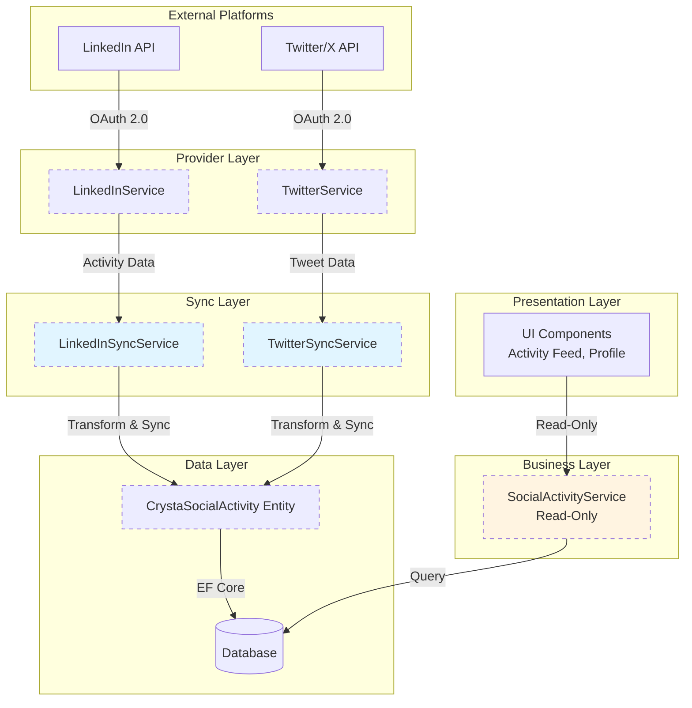
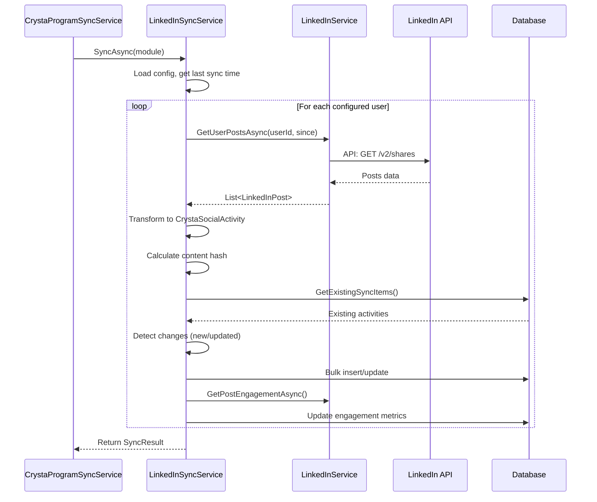
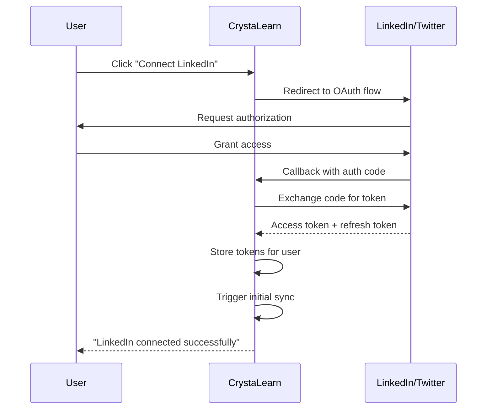

# Social Activity Sync Overview - LinkedIn & Twitter Integration (Planned)

## Introduction

The Social Activity Sync system is a **planned feature** that will synchronize professional and social media activities from LinkedIn and Twitter into CrystaLearn as `CrystaSocialActivity` entities. This will enable comprehensive tracking of learners' public engagement, professional networking, and knowledge-sharing activities.

> **⚠️ Status:** This document describes a future implementation. The models, services, and workflows outlined here are not yet implemented in the codebase.

## Motivation

Learners in the CS Internship program engage in various activities beyond direct coursework:
- Sharing learnings on LinkedIn
- Participating in technical discussions on Twitter
- Publishing articles and posts about their journey
- Networking with industry professionals
- Contributing to open-source discussions

Currently, these valuable activities are not captured in CrystaLearn. The Social Activity Sync system will:
- Automatically track public social media engagement
- Recognize and reward active learners
- Build comprehensive learner profiles
- Support badge and achievement systems
- Enable peer discovery and collaboration

## Planned Architecture



*Note: Components with dashed lines are planned for future implementation*

## Planned Data Model

### CrystaSocialActivity Entity

```csharp
public class CrystaSocialActivity : Entity
{
    // Provider Information
    public SocialPlatform Platform { get; set; }         // LinkedIn, Twitter
    public string? ProviderActivityId { get; set; }      // Platform-specific ID
    public string? ProviderActivityUrl { get; set; }     // Link to original post
    
    // Activity Type
    public SocialActivityType ActivityType { get; set; } // Post, Comment, Share, Like, Article
    
    // Content
    [MaxLength(500)]
    public string? Title { get; set; }                   // For articles/posts
    public string? Content { get; set; }                 // Full text content
    public string? ContentHtml { get; set; }             // HTML rendered content
    public string? ContentSnippet { get; set; }          // Short preview
    
    // Media
    public List<string>? MediaUrls { get; set; }         // Images, videos
    public List<string>? Hashtags { get; set; }          // Extracted hashtags
    public List<string>? Mentions { get; set; }          // @mentions
    
    // Engagement Metrics
    public int LikeCount { get; set; }
    public int CommentCount { get; set; }
    public int ShareCount { get; set; }
    public int ViewCount { get; set; }
    
    // Dates
    public DateTimeOffset ActivityDateTime { get; set; }  // When posted
    public DateTimeOffset? LastEngagementSync { get; set; } // Last metric update
    
    // User Association
    public Guid? UserId { get; set; }
    public User? User { get; set; }
    public string? UserDisplayName { get; set; }          // Fallback if User not found
    
    // Categorization
    public bool IsProfessional { get; set; }              // LinkedIn = true, Twitter = depends
    public bool IsEducational { get; set; }               // AI/ML detected educational content
    public List<string>? Topics { get; set; }             // Extracted/categorized topics
    
    // Sync Metadata
    public SyncInfo SyncInfo { get; set; }
    
    // Program Association (optional)
    public Guid? CrystaProgramId { get; set; }
    public CrystaProgram? CrystaProgram { get; set; }
    
    // Status
    public bool IsActive { get; set; }
    public ActivityVisibility Visibility { get; set; }    // Public, ConnectionsOnly, Private
}
```

### Supporting Enums

```csharp
public enum SocialPlatform
{
    LinkedIn,
    Twitter,
    // Future: Facebook, Instagram, YouTube, Dev.to, Medium
}

public enum SocialActivityType
{
    Post,           // Original post/tweet
    Comment,        // Comment on someone else's content
    Share,          // Retweet, repost
    Like,           // Simple engagement
    Article,        // LinkedIn article, Medium post
    Video,          // Video post
    Poll,           // Poll/survey
    Event,          // Event participation
}

public enum ActivityVisibility
{
    Public,
    ConnectionsOnly,
    Private,
    Deleted,        // Original post deleted
}
```

## Planned Provider Services

### 1. LinkedInService

**Responsibilities:**
- Authenticate with LinkedIn OAuth 2.0
- Fetch user's posts, articles, and shares
- Retrieve engagement metrics (likes, comments, shares)
- Access connection activity (with permissions)

**Planned Methods:**

```csharp
public partial class LinkedInService : ILinkedInService
{
    // Get user's recent posts
    Task<List<LinkedInPost>> GetUserPostsAsync(
        string userId, 
        DateTimeOffset? since = null,
        int count = 100);

    // Get user's published articles
    Task<List<LinkedInArticle>> GetUserArticlesAsync(
        string userId,
        DateTimeOffset? since = null);

    // Get engagement metrics for a post
    Task<LinkedInEngagement> GetPostEngagementAsync(string postId);

    // Get comments on a post
    Task<List<LinkedInComment>> GetPostCommentsAsync(string postId);

    // Verify user authorization
    Task<bool> IsAuthorizedAsync(string userId);
}
```

**LinkedIn API Considerations:**
- **Authentication:** OAuth 2.0 with scopes: `r_liteprofile`, `r_emailaddress`, `w_member_social`
- **Rate Limits:** Throttle limits per app and per user
- **Data Access:** Limited to user's own content unless using Marketing API
- **Webhook Support:** Real-time notifications for new posts

### 2. TwitterService

**Responsibilities:**
- Authenticate with Twitter/X API v2
- Fetch user's tweets and retweets
- Retrieve engagement metrics
- Access timeline and mentions

**Planned Methods:**

```csharp
public partial class TwitterService : ITwitterService
{
    // Get user's recent tweets
    Task<List<Tweet>> GetUserTweetsAsync(
        string username,
        DateTimeOffset? since = null,
        int maxResults = 100);

    // Get tweet metrics (likes, retweets, replies)
    Task<TweetMetrics> GetTweetMetricsAsync(string tweetId);

    // Get user's retweets
    Task<List<Tweet>> GetUserRetweetsAsync(string username);

    // Search user's tweets by hashtag
    Task<List<Tweet>> SearchUserTweetsAsync(
        string username,
        string query,
        DateTimeOffset? since = null);

    // Verify user authorization
    Task<bool> IsAuthorizedAsync(string username);
}
```

**Twitter API Considerations:**
- **Authentication:** OAuth 2.0 or API Key/Secret
- **Rate Limits:** Varies by endpoint and tier (Free, Basic, Pro, Enterprise)
- **Tweet Cap:** Free tier limited to recent tweets only
- **Real-time:** Streaming API for live updates (paid tiers)

## Planned Sync Services

### LinkedInSyncService

**Sync Flow:**



**Configuration:**

```csharp
public class LinkedInSyncConfig
{
    public string ClientId { get; set; }
    public string ClientSecret { get; set; }
    public List<LinkedInUserMapping> UserMappings { get; set; }
    public DateTimeOffset? InitialSyncFromDate { get; set; }
    public bool SyncEngagementMetrics { get; set; } = true;
    public int EngagementSyncIntervalHours { get; set; } = 24;
}

public class LinkedInUserMapping
{
    public string LinkedInUserId { get; set; }    // LinkedIn URN
    public Guid CrystaLearnUserId { get; set; }   // Internal user ID
    public string AccessToken { get; set; }        // OAuth token
    public DateTimeOffset TokenExpiry { get; set; }
}
```

### TwitterSyncService

**Sync Flow:** Similar to LinkedIn, adapted for Twitter API structure

**Configuration:**

```csharp
public class TwitterSyncConfig
{
    public string ApiKey { get; set; }
    public string ApiKeySecret { get; set; }
    public string BearerToken { get; set; }
    public List<TwitterUserMapping> UserMappings { get; set; }
    public DateTimeOffset? InitialSyncFromDate { get; set; }
    public List<string>? TrackHashtags { get; set; }     // Optional: #csinternship
    public bool IncludeRetweets { get; set; } = true;
    public bool IncludeReplies { get; set; } = true;
}

public class TwitterUserMapping
{
    public string TwitterUsername { get; set; }
    public Guid CrystaLearnUserId { get; set; }
    public string? AccessToken { get; set; }       // For user context
    public string? AccessTokenSecret { get; set; }
}
```

## Planned Sync Strategies

### 1. User-Initiated Authorization



### 2. Scheduled Sync

**Frequency:**
- **Posts/Tweets:** Every 6 hours
- **Engagement Metrics:** Every 24 hours
- **User Profiles:** Weekly

**Hangfire Jobs:**

```csharp
public class SocialActivitySyncJob
{
    [AutoInject] private ICrystaProgramSyncService SyncService { get; set; }
    
    [RecurringJob("0 */6 * * *")] // Every 6 hours
    public async Task SyncLinkedInActivities()
    {
        var modules = await GetLinkedInSyncModules();
        foreach (var module in modules)
        {
            await SyncService.SyncAsync(module);
        }
    }
    
    [RecurringJob("15 */6 * * *")] // Every 6 hours, offset by 15 min
    public async Task SyncTwitterActivities()
    {
        var modules = await GetTwitterSyncModules();
        foreach (var module in modules)
        {
            await SyncService.SyncAsync(module);
        }
    }
}
```

### 3. Webhook-Based Real-Time Sync

**LinkedIn Webhooks (when available):**
```csharp
[HttpPost("api/webhooks/linkedin")]
public async Task<IActionResult> LinkedInWebhook([FromBody] LinkedInWebhookEvent evt)
{
    // Verify webhook signature
    if (!VerifyLinkedInSignature(evt))
        return Unauthorized();
    
    // Queue sync job for specific user/post
    await SyncService.SyncSingleActivityAsync(evt.UserId, evt.PostId);
    
    return Ok();
}
```

## Transformation & Enrichment

### Content Analysis

**Planned AI/ML Features:**

1. **Topic Extraction**
   ```csharp
   var topics = await TopicExtractor.ExtractAsync(activity.Content);
   activity.Topics = topics; // ["C#", "Azure", "Clean Code"]
   ```

2. **Sentiment Analysis**
   ```csharp
   var sentiment = await SentimentAnalyzer.AnalyzeAsync(activity.Content);
   activity.Sentiment = sentiment; // Positive, Neutral, Negative
   ```

3. **Educational Content Detection**
   ```csharp
   var isEducational = await EducationalContentDetector.IsEducationalAsync(activity);
   activity.IsEducational = isEducational;
   ```

4. **Hashtag Categorization**
   ```csharp
   // Group hashtags: #csinternship → Program tag, #cleancode → Technical tag
   activity.ProgramTags = ExtractProgramTags(activity.Hashtags);
   activity.TechnicalTags = ExtractTechnicalTags(activity.Hashtags);
   ```

### Platform-Specific Transformations

**LinkedIn Post → CrystaSocialActivity:**

```csharp
private CrystaSocialActivity ToSocialActivity(LinkedInPost post, User user)
{
    return new CrystaSocialActivity
    {
        Platform = SocialPlatform.LinkedIn,
        ProviderActivityId = post.Id,
        ProviderActivityUrl = post.Permalink,
        ActivityType = DetermineActivityType(post),
        
        Title = post.Title,
        Content = post.Text,
        ContentHtml = post.Content?.Html,
        ContentSnippet = TruncateText(post.Text, 200),
        
        MediaUrls = post.Content?.Media?.Select(m => m.Url).ToList(),
        Hashtags = ExtractHashtags(post.Text),
        Mentions = ExtractMentions(post.Text),
        
        LikeCount = post.Engagement?.LikeCount ?? 0,
        CommentCount = post.Engagement?.CommentCount ?? 0,
        ShareCount = post.Engagement?.ShareCount ?? 0,
        
        ActivityDateTime = post.CreatedAt,
        UserId = user.Id,
        UserDisplayName = user.DisplayName,
        
        IsProfessional = true, // LinkedIn is professional by default
        Visibility = MapVisibility(post.Visibility),
        
        SyncInfo = new SyncInfo
        {
            SyncId = post.Id,
            SyncHash = ComputeHash(post),
            LastSyncDateTime = DateTimeOffset.Now
        }
    };
}
```

**Tweet → CrystaSocialActivity:**

```csharp
private CrystaSocialActivity ToSocialActivity(Tweet tweet, User user)
{
    return new CrystaSocialActivity
    {
        Platform = SocialPlatform.Twitter,
        ProviderActivityId = tweet.Id,
        ProviderActivityUrl = $"https://twitter.com/{user.TwitterUsername}/status/{tweet.Id}",
        ActivityType = DetermineTwitterActivityType(tweet),
        
        Content = tweet.Text,
        ContentSnippet = TruncateText(tweet.Text, 140),
        
        MediaUrls = tweet.Attachments?.MediaKeys?.Select(k => GetMediaUrl(k)).ToList(),
        Hashtags = tweet.Entities?.Hashtags?.Select(h => h.Tag).ToList(),
        Mentions = tweet.Entities?.Mentions?.Select(m => m.Username).ToList(),
        
        LikeCount = tweet.PublicMetrics?.LikeCount ?? 0,
        CommentCount = tweet.PublicMetrics?.ReplyCount ?? 0,
        ShareCount = tweet.PublicMetrics?.RetweetCount ?? 0,
        
        ActivityDateTime = tweet.CreatedAt,
        UserId = user.Id,
        
        IsProfessional = DetermineIfProfessional(tweet),
        Visibility = ActivityVisibility.Public,
        
        SyncInfo = new SyncInfo
        {
            SyncId = tweet.Id,
            SyncHash = ComputeHash(tweet),
            LastSyncDateTime = DateTimeOffset.Now
        }
    };
}
```

## Planned UI Features

### User Profile

**Social Activity Timeline:**
```
┌─────────────────────────────────────────────┐
│ John Doe's Social Activity                 │
├─────────────────────────────────────────────┤
│ 📘 LinkedIn · 2 hours ago                   │
│ Published: "Clean Code Principles in C#"   │
│ 👍 45 likes · 💬 12 comments · 🔄 8 shares  │
├─────────────────────────────────────────────┤
│ 🐦 Twitter · 1 day ago                      │
│ "Just completed my first Azure deployment  │
│  #csinternship #azure #devops"             │
│ 👍 23 likes · 💬 5 replies · 🔄 3 retweets  │
└─────────────────────────────────────────────┘
```

### Activity Feed

**Program-Wide Feed:**
```
┌─────────────────────────────────────────────┐
│ CS Internship Social Activity Feed         │
├─────────────────────────────────────────────┤
│ 🔥 Top Posts This Week                      │
│                                             │
│ 1. Sarah K. - "Microservices Architecture" │
│    📘 LinkedIn · 234 engagements            │
│                                             │
│ 2. Mike R. - "My First Pull Request"       │
│    🐦 Twitter · 189 engagements             │
└─────────────────────────────────────────────┘
```

### Badge Integration

**Social Engagement Badges:**
- 🎯 **Active Sharer** - 10+ posts in a month
- 📝 **Content Creator** - 5+ articles published
- 💬 **Community Helper** - 50+ meaningful comments
- 🌟 **Influencer** - 1000+ total engagements

## Data Governance

### Privacy & Consent

**Principles:**
1. **Opt-In Only:** Users must explicitly authorize CrystaLearn to access their social media
2. **Transparent Scope:** Clearly communicate what data is accessed and why
3. **User Control:** Users can disconnect at any time
4. **Public Data Only:** Only sync publicly visible posts (respect user privacy settings)
5. **No Cross-Posting:** CrystaLearn never posts on behalf of users

**Authorization Flow:**
```csharp
public class SocialAuthorizationService
{
    public async Task<bool> RequestLinkedInAuthorizationAsync(Guid userId)
    {
        // Show consent screen explaining:
        // - What data will be synced (posts, articles, engagement)
        // - Why (profile building, badges, recognition)
        // - How to revoke (disconnect button)
        
        var consent = await ShowConsentDialogAsync();
        if (!consent.Approved)
            return false;
        
        // Redirect to LinkedIn OAuth
        return await InitiateOAuthFlowAsync(userId, SocialPlatform.LinkedIn);
    }
}
```

### Data Retention

**Policies:**
- Active posts: Retained indefinitely
- Deleted posts: Marked as `Visibility.Deleted`, content archived
- Disconnected accounts: Activities retained but no longer synced
- GDPR compliance: User can request full deletion

## Challenges & Considerations

### 1. API Rate Limits

**LinkedIn:**
- Rate limits vary by endpoint
- Need to batch requests efficiently
- Implement exponential backoff

**Twitter:**
- Free tier very restrictive (1,500 tweets/month)
- May require paid tier for meaningful sync
- Consider user-initiated sync vs. automatic

### 2. Content Ownership

- Synced content belongs to the original author
- CrystaLearn displays with proper attribution
- Must respect platform terms of service

### 3. Deleted Content

**Strategy:**
```csharp
// Periodic cleanup job
[RecurringJob("0 2 * * *")] // Daily at 2 AM
public async Task SyncDeletedActivities()
{
    var recentActivities = await GetActivitiesFromLast30Days();
    
    foreach (var activity in recentActivities)
    {
        var stillExists = await CheckIfActivityExistsAsync(activity);
        
        if (!stillExists)
        {
            activity.Visibility = ActivityVisibility.Deleted;
            activity.IsActive = false;
            // Keep record for audit trail
        }
    }
}
```

### 4. Engagement Metric Staleness

- Metrics change over time (likes, shares)
- Trade-off: Freshness vs. API calls
- Strategy: Sync popular posts more frequently

### 5. Multi-Account Support

Users may have multiple LinkedIn/Twitter accounts:
- Allow multiple connections per platform
- User selects "primary" for badge calculations
- Aggregate activities from all connected accounts

## Implementation Roadmap

### Phase 1: Foundation (Months 1-2)
- [ ] Define `CrystaSocialActivity` model
- [ ] Create `SocialPlatform` and `SocialActivityType` enums
- [ ] Set up LinkedIn OAuth integration
- [ ] Implement `LinkedInService` (basic)
- [ ] Build `LinkedInSyncService`
- [ ] Create sync configuration UI

### Phase 2: LinkedIn Full Integration (Months 3-4)
- [ ] Add engagement metrics sync
- [ ] Implement content transformation and enrichment
- [ ] Build user profile social activity timeline
- [ ] Create activity feed UI
- [ ] Add "Connect LinkedIn" button to user settings

### Phase 3: Twitter Integration (Months 5-6)
- [ ] Set up Twitter API access
- [ ] Implement `TwitterService`
- [ ] Build `TwitterSyncService`
- [ ] Unified activity feed (LinkedIn + Twitter)
- [ ] Hashtag-based filtering (#csinternship)

### Phase 4: Intelligence & Automation (Months 7-8)
- [ ] AI-powered topic extraction
- [ ] Educational content detection
- [ ] Sentiment analysis
- [ ] Automatic badge awards based on social activity
- [ ] Leaderboards and recognition

### Phase 5: Advanced Features (Months 9-12)
- [ ] Webhook-based real-time sync
- [ ] Multi-account support
- [ ] Content analytics dashboard
- [ ] Export/reporting features
- [ ] Additional platforms (Dev.to, Medium, YouTube)

## Success Metrics

**KPIs to Track:**
- Number of users with connected social accounts
- Total activities synced per month
- User engagement with activity feed
- Badges awarded based on social activity
- Correlation between social activity and learning outcomes

## Related Documentation

- [Sync System Overview](./sync-overview.md)
- [Task Sync Overview](./sync-task-overview.md)
- [Document Sync Overview](./sync-document-overview.md)

## Conclusion

The Social Activity Sync system represents a significant enhancement to CrystaLearn's ability to recognize and reward learners' public engagement. By integrating with LinkedIn and Twitter, we can capture a more complete picture of each learner's professional development and community participation.

**Key Benefits:**
1. **Holistic Profiles** - Complete view of learner activities
2. **Automated Recognition** - Badges and achievements for social engagement
3. **Community Building** - Discover and connect with active learners
4. **Motivation** - Public recognition drives participation
5. **Industry Alignment** - Professional networking is a core career skill

This planned feature will position CrystaLearn as a comprehensive learning ecosystem that values and tracks all dimensions of professional growth.
