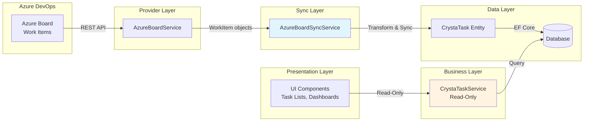
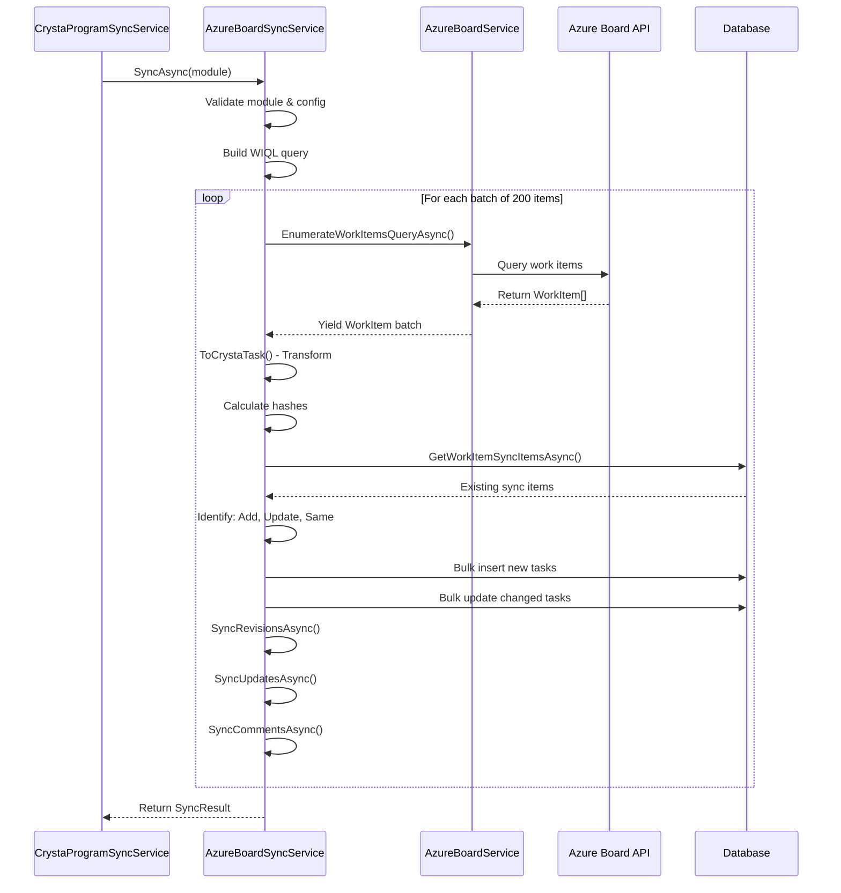

# Task Sync Overview - Azure DevOps Board Integration

## Introduction

The Task Sync system synchronizes work items from Azure DevOps Board into CrystaLearn as `CrystaTask` entities. This enables learners and coordinators to view their assigned tasks, track progress, and monitor project activities without leaving the CrystaLearn platform.

## Architecture Overview



## Key Components

### 1. CrystaTask Model

The `CrystaTask` entity represents a normalized task in CrystaLearn, regardless of its origin:

```csharp
public class CrystaTask : Entity
{
    // External Provider Info
    public string? ProviderTaskId { get; set; }      // Azure Board Work Item ID
    public string? ProviderTaskUrl { get; set; }     // Link back to Azure Board
    
    // Task Details
    public string? Title { get; set; }
    public string? Description { get; set; }
    public string? DescriptionHtml { get; set; }
    public CrystaTaskStatus? Status { get; set; }    // New, InProgress, Done, Canceled
    
    // Dates
    public DateTimeOffset? TaskCreateDateTime { get; set; }
    public DateTimeOffset? TaskDoneDateTime { get; set; }
    public DateTimeOffset? TaskAssignDateTime { get; set; }
    
    // People
    public User? AssignedTo { get; set; }
    public User? CompletedBy { get; set; }
    public User? CreatedBy { get; set; }
    public string? AssignedToText { get; set; }      // Fallback if User not found
    public string? CompletedByText { get; set; }
    public string? CreatedByText { get; set; }
    
    // Sync Metadata
    public SyncInfo WorkItemSyncInfo { get; set; }   // Main work item sync
    public SyncInfo RevisionsSyncInfo { get; set; }  // Work item history
    public SyncInfo UpdatesSyncInfo { get; set; }    // Work item updates
    public SyncInfo CommentsSyncInfo { get; set; }   // Work item comments
    
    // Program Association
    public CrystaProgram? CrystaProgram { get; set; }
}
```

### 2. AzureBoardService (Provider Layer)

**Location:** `CrystaLearn.Core/Services/AzureBoard/AzureBoardService.cs`

**Responsibility:** Low-level communication with Azure DevOps REST API

**Key Methods:**

```csharp
public partial class AzureBoardService : IAzureBoardService
{
    // Query work items with pagination (up to 200 per call)
    Task<List<WorkItem>> GetWorkItemsRawQueryAsync(
        AzureBoardSyncConfig config, 
        string query, 
        string[]? fields = null,
        int? top = 200);

    // Enumerate large result sets (up to 19,999 items) in batches
    IAsyncEnumerable<List<WorkItem>> EnumerateWorkItemsQueryAsync(
        AzureBoardSyncConfig config,
        string query,
        string[]? fields = null,
        int top = 19_999);

    // Get historical revisions of a work item
    Task<List<WorkItem>> GetRevisionsAsync(int workItemId);

    // Get incremental updates to a work item
    Task<List<WorkItemUpdate>> GetUpdatesAsync(int workItemId);
}
```

**Connection Details:**
- Uses `VssConnection` from Azure DevOps SDK
- Authenticates with Personal Access Token (PAT)
- Connects to: `https://dev.azure.com/{Organization}`

**Fields Retrieved:**
```csharp
[
    "System.Id",
    "System.Title",
    "System.Description",
    "System.State",
    "System.Tags",
    "System.WorkItemType",
    "System.AssignedTo",
    "System.CreatedDate",
    "System.ChangedDate",
    "System.AreaPath",
    "System.IterationPath"
]
```

### 3. AzureBoardSyncService (Sync Layer)

**Location:** `CrystaLearn.Core/Services/Sync/AzureBoardSyncService.cs`

**Responsibility:** Orchestrate sync between Azure Board and CrystaLearn database

**Sync Flow:**



**Key Sync Logic:**

```csharp
public async Task<SyncResult> SyncAsync(CrystaProgramSyncModule module)
{
    // 1. Validate configuration
    var config = JsonSerializer.Deserialize<AzureBoardSyncConfig>(module.SyncConfig);
    var project = config.Project;
    var lastSyncDateTime = module.SyncInfo.LastSyncDateTime 
                          ?? config.WorkItemChangedFromDateTime;

    // 2. Build incremental WIQL query
    var query = $"""
        Select [Id] 
        From WorkItems 
        Where 
            [Changed Date] >= '{lastSyncDateTime:yyyy/MM/dd}'
            And [System.TeamProject] = '{project}' 
            And [System.State] <> 'Closed' 
        Order By [Changed Date] Asc
        """;

    // 3. Enumerate and sync in batches
    await foreach (var workItems in AzureBoardService.EnumerateWorkItemsQueryAsync(config, query, top: 200))
    {
        var tasks = workItems.Select(ToCrystaTask).ToList();
        
        await SyncWorkItemsAsync(tasks);      // Main work item sync
        await SyncUpdatesAsync(tasks);        // Incremental updates
        await SyncCommentsAsync(tasks);       // Comments
        await SyncRevisionsAsync(tasks);      // Full revision history
    }
    
    return new SyncResult { AddCount, UpdateCount, SameCount };
}
```

**Change Detection:**

```csharp
private async Task<SyncResult> SyncWorkItemsAsync(List<CrystaTask> tasks)
{
    // 1. Extract sync info from incoming tasks
    var boardSyncItems = tasks
        .Select(task => new SyncItem { SyncInfo = task.WorkItemSyncInfo })
        .ToList();

    // 2. Get existing sync items from database
    var ids = boardSyncItems.Select(wi => wi.SyncInfo.SyncId).ToList();
    var existingWorkItemSyncItems = await CrystaTaskRepository.GetWorkItemSyncItemsAsync(ids);

    // 3. Categorize changes
    var toAddList = boardSyncItems
        .Where(board => existingWorkItemSyncItems
            .All(existing => board.SyncInfo.SyncId != existing.SyncInfo.SyncId))
        .ToList();

    var toUpdateList = boardSyncItems
        .Where(board => existingWorkItemSyncItems
            .Any(existing => 
                board.SyncInfo.SyncId == existing.SyncInfo.SyncId && 
                board.SyncInfo.SyncHash != existing.SyncInfo.SyncHash))
        .ToList();

    var sameList = boardSyncItems
        .Except(toAddList)
        .Except(toUpdateList)
        .ToList();

    // 4. Apply changes to database
    // (Implementation pending)
    
    return new SyncResult 
    { 
        AddCount = toAddList.Count,
        UpdateCount = toUpdateList.Count,
        SameCount = sameList.Count
    };
}
```

### 4. Transformation Logic

**Mapping Azure Board Work Item to CrystaTask:**

```csharp
private CrystaTask ToCrystaTask(WorkItem workItem)
{
    // 1. Create hash for change detection
    var json = JsonSerializer.Serialize(workItem.Fields);
    var hash = json.Sha();

    // 2. Build sync metadata
    var syncInfo = new SyncInfo
    {
        SyncId = workItem.Id.ToString(),
        SyncHash = hash,
        LastSyncDateTime = DateTimeOffset.Now,
        LastSyncOffset = workItem.Id.ToString()
    };

    // 3. Map status
    var status = workItem.Fields["System.State"]?.ToString() switch
    {
        "New" or "To Do" => CrystaTaskStatus.New,
        "Approved" or "In Progress" or "Committed" => CrystaTaskStatus.InProgress,
        "Done" or "Closed" => CrystaTaskStatus.Done,
        "Canceled" or "Removed" => CrystaTaskStatus.Canceled,
        _ => throw new Exception($"Invalid status: {workItem.Fields["System.State"]}")
    };

    // 4. Extract user information
    var assignedToText = workItem.Fields.GetValueOrDefault("System.AssignedTo") switch 
    {
        IdentityRef identityRef => $"{identityRef.DisplayName} ({identityRef.UniqueName})",
        _ => ""
    };

    // 5. Build CrystaTask entity
    return new CrystaTask
    {
        ProviderTaskId = workItem.Id?.ToString(),
        Title = workItem.Fields["System.Title"]?.ToString(),
        Status = status,
        TaskCreateDateTime = DateTimeOffset.Parse(workItem.Fields["System.CreatedDate"]?.ToString()),
        ProviderTaskUrl = workItem.Url,
        WorkItemSyncInfo = syncInfo,
        AssignedToText = assignedToText,
    };
}
```

## Configuration

### AzureBoardSyncConfig

```csharp
public class AzureBoardSyncConfig
{
    public string Organization { get; set; }              // e.g., "cs-internship"
    public string Project { get; set; }                   // e.g., "CrystaLearn"
    public string PersonalAccessToken { get; set; }       // Azure DevOps PAT
    public DateTimeOffset? WorkItemChangedFromDateTime { get; set; }  // Initial sync start date
}
```

**Stored in:** `CrystaProgramSyncModule.SyncConfig` as JSON

**Example:**
```json
{
  "Organization": "cs-internship",
  "Project": "CrystaLearn",
  "PersonalAccessToken": "xxxxxxxxxxxxxxxxxxxx",
  "WorkItemChangedFromDateTime": "2024-01-01T00:00:00Z"
}
```

## Incremental Sync Strategy

### First Sync
1. Use `WorkItemChangedFromDateTime` from config as starting point
2. Query all work items changed since that date
3. Insert all items as new records
4. Store `LastSyncDateTime` in `module.SyncInfo`

### Subsequent Syncs
1. Use `LastSyncDateTime` from previous sync
2. Query only work items changed since last sync
3. Compare hashes to detect actual changes
4. Insert new, update changed, skip unchanged
5. Update `LastSyncDateTime` to current time

### WIQL Query Structure

```sql
Select [Id] 
From WorkItems 
Where 
    [Changed Date] >= '2024-11-14'
    And [System.TeamProject] = 'CrystaLearn' 
    And [System.State] <> 'Closed' 
Order By [Changed Date] Asc
```

**Key Points:**
- Incremental based on `Changed Date`
- Filters by project
- Excludes closed items
- Orders chronologically for consistent pagination

## Read-Only Pattern

### CrystaTaskService (Not Yet Implemented)

The planned `CrystaTaskService` will provide read-only access:

```csharp
public partial class CrystaTaskService : ICrystaTaskService
{
    // Query operations only - no Add/Update/Delete
    Task<List<CrystaTask>> GetTasksByProgramAsync(string programCode);
    Task<List<CrystaTask>> GetTasksByAssigneeAsync(Guid userId);
    Task<CrystaTask?> GetTaskByProviderIdAsync(string providerId);
    Task<List<CrystaTask>> GetTasksByStatusAsync(CrystaTaskStatus status);
}
```

**UI Interaction:**
- Users view tasks in CrystaLearn
- To modify a task, users click `ProviderTaskUrl` to open Azure Board
- All edits happen in Azure Board
- Next sync brings changes back to CrystaLearn

## Data Governance

### Single Source of Truth
- **Azure DevOps Board** is the authoritative source for task data
- CrystaLearn maintains a read-only cache for display and reporting
- No direct task creation/modification in CrystaLearn

### Sync Guarantees
- **Idempotent**: Re-running sync with same data causes no issues
- **Eventually Consistent**: Changes in Azure Board appear in CrystaLearn after next sync
- **Change Detection**: Hash-based comparison prevents unnecessary writes
- **Audit Trail**: Full sync metadata in `WorkItemSyncInfo`

### Planned Sync Sub-Types

| Sync Type | Purpose | Status |
|-----------|---------|--------|
| Work Items | Main task data | ✅ Implemented (partial) |
| Revisions | Historical changes | 🔜 Planned |
| Updates | Incremental field changes | 🔜 Planned |
| Comments | Discussion threads | 🔜 Planned |

## Monitoring & Observability

### Sync Results

After each sync operation, `SyncResult` provides metrics:

```csharp
var result = await SyncAsync(module);
// result.AddCount    - New tasks added
// result.UpdateCount - Existing tasks updated  
// result.SameCount   - Tasks unchanged
```

### Sync Metadata

Each `CrystaTask` tracks detailed sync information:

```csharp
task.WorkItemSyncInfo.SyncId              // Azure Board Work Item ID
task.WorkItemSyncInfo.SyncHash            // Current data hash
task.WorkItemSyncInfo.LastSyncDateTime    // When last synced
task.WorkItemSyncInfo.SyncStatus          // Success/Failed
```

## Error Handling

### Validation Errors
```csharp
// Invalid module type
if (module.ModuleType != SyncModuleType.AzureBoard)
    throw new InvalidOperationException("Invalid module type");

// Missing configuration
if (string.IsNullOrWhiteSpace(module.SyncConfig))
    throw new ArgumentNullException(nameof(module.SyncConfig));

// Invalid status mapping
_ => throw new Exception($"Invalid status: {workItem.Fields["System.State"]}")
```

### API Limits
- **Query Limit**: Maximum 19,999 work items per query
- **Batch Size**: 200 items per API call
- **Field Limit**: Specific fields requested to minimize payload

## Performance Considerations

### Batching
- Work items retrieved in batches of 200
- Each batch processed independently
- Supports large-scale synchronization

### Parallel Processing
- Multiple batches can be processed concurrently (future enhancement)
- Database bulk operations for efficient inserts/updates

### Hash-Based Skip
- Only changed items trigger database writes
- `SameCount` tracks skipped items
- Reduces database load significantly

## Future Enhancements

1. **Revision Sync** - Track complete work item history
2. **Update Sync** - Capture field-level changes
3. **Comment Sync** - Include discussion threads
4. **User Mapping** - Link `AssignedToText` to actual `User` entities
5. **Bi-directional Sync** - Allow task creation from CrystaLearn (requires policy changes)
6. **Real-time Sync** - Webhook-based immediate sync on changes
7. **Conflict Resolution** - Handle concurrent modifications
8. **Soft Delete** - Track removed work items

## Related Documentation

- [Sync System Overview](./sync-overview.md)
- [Document Sync Overview](./sync-document-overview.md)
- [Social Activity Sync Overview](./sync-social-activity-overview.md)
